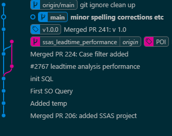

# Why would you do that ?

I've been working on a project. Not a very big project. We started out putting everything in one big repository. Looking back that was not that good of an idea. And so we need to split up the repo again. <br> 

We need e.g SQL and SSAS in it's own repo and the Typescript App in another

### Folder structure.


```
project
│   README.md
│   file001  
│
└───SQL
│   │   file011
│   │   file012
|
└───TypescriptProject
│   │   file111
│   │   file112
│   │   ...
│   
└───SSAS
    │   file021
    │   file022
```
##### _A simplified hierachy of the folder structure, could look a bit like this._


## Simpel solution:

We could of course just copy the folders into new git repo. But even though the history isn't that long, we would still loose a lot.
## Splitting the repo by folder structure.

I've looked at [this guide](https://ao.ms/how-to-split-a-subdirectory-to-a-new-git-repository-and-keep-the-history/), and tried to use the built in git command: ```filter-branch```

### Filter branch commands

This one will prune everything except TypeScriptFolder

``` bash
git filter-branch --prune-empty --subdirectory-filter T dev/slund/new-test-try
```
## But there is a problem

It's a big hastle, if even posible, to use the ```filter-branch``` command on multiple folders. Also that command comes with a lot of disclaimers. One of thos disclaimers is to look into another 3rd party tool: [Git-Filter-Repo](https://github.com/newren/git-filter-repo)

## It took a while to make it work. 

Installing it with scoop seemed to do the trick:
```
scoop install git-filter-repo
```

### With Git-Filter-Repo installed:

I could clone the repo into to seperate new repos and run e.g:
``` 
git filter-repo --path Connectors/ --path SQL --path SSAS/
```

That worked out brilliantly, and made  a very need tree of changes:



